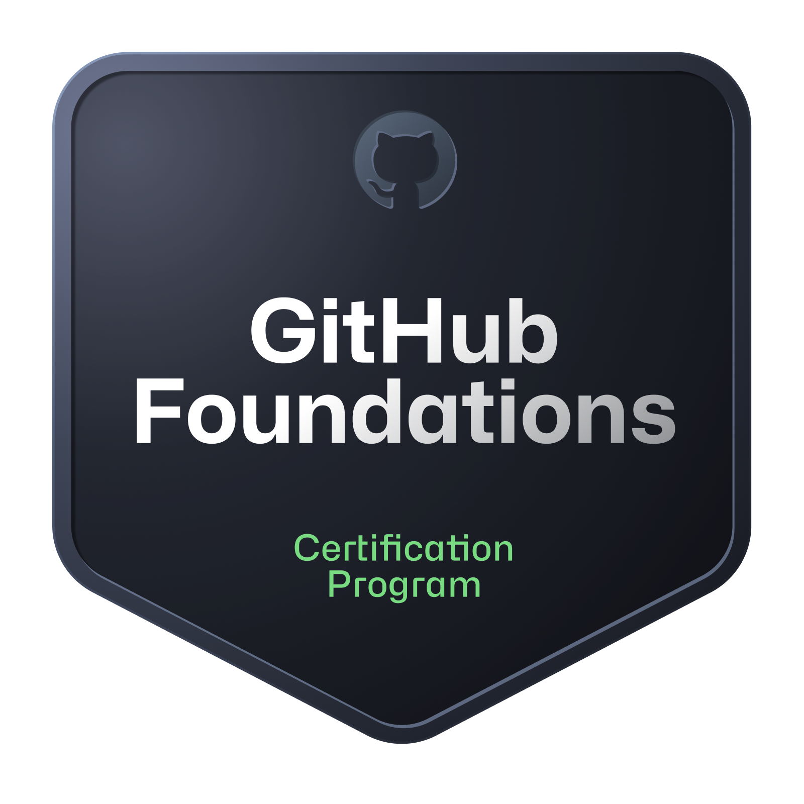
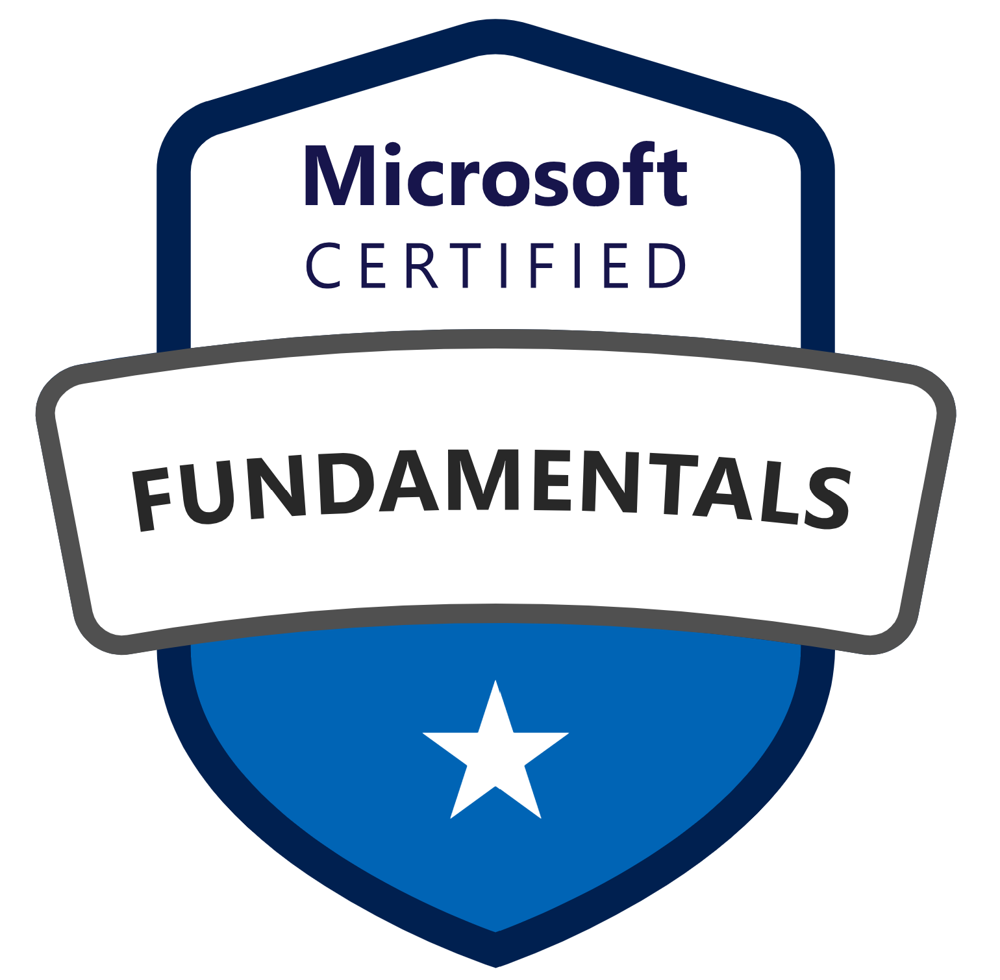
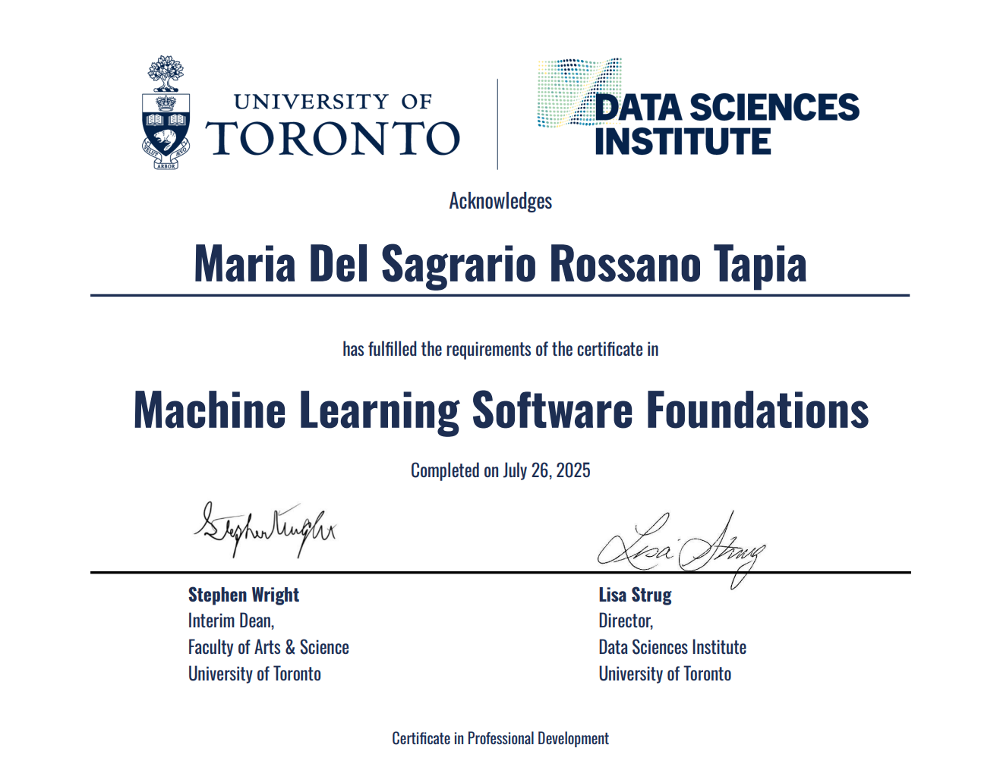

# 👋 Hi, I'm Maria!
## 👩‍🔬 Computational Chemist | AI Researcher
---

### 🧠 **About Me**
- 🔬 I work at the intersection of chemistry and data science (in particular, machine learning)
- 💻 Currently exploring NN for the prediction of chemical properties
- 📖 With a background in coding, research, and teaching

### 🧰 **Tech Stack**
- 💡 **Languages:** Python, Bash, MATLAB, C++
- 🧪 **Tools:** Pandas, Numpy, Tensorflow, PyTorch, CompChem software, RDKit, among others 😄

### 📛**My badges**

---

Stats card created using [streak-stats tool](https://git.io/streak-stats)
